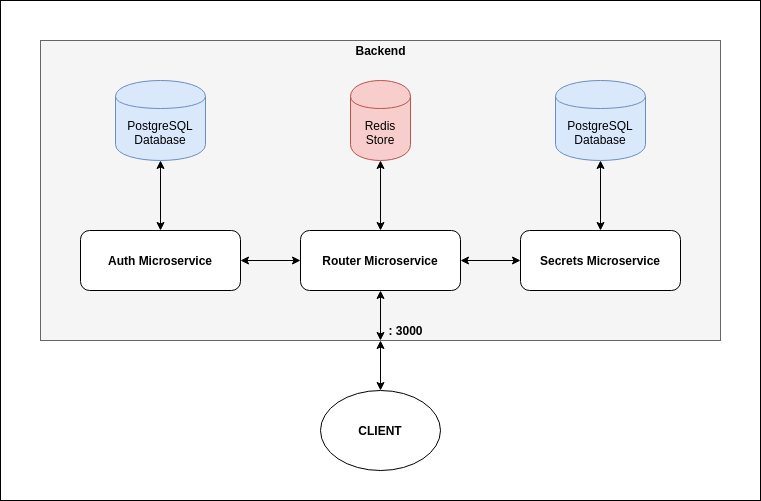

# CKRET: A backend for an authentication-based secret management service.

The backend exposes API endpoints for clients to signup users, login users, and to use authentication tokens for storing and managing user secrets (where secrets basically mean key-value pairs, such as username-passswords, making this backend ideal for, say, a password manager webapp).

List of exposed API endpoints:
* POST /signup
* POST /login
* * GET /secrets/:username
* POST /secrets/:username
  * Body must have a "key" and a "value" key.
* PUT /secrets/:username/:id
  *  Body must have a "key" and a "value" key.
* DELETE /secrets/:username/:id

The microservice exposes and listens on :3000 by default at the router microservice. You can of course change that in the docker file and in the NodeJS code.

## How to run this on your setup?

To run this without having to setup up all of the requirements (Postgres, Redis, and NodeJS), you must have Docker and Docker-Compose installed.
* `cd` into the directory
* `docker-compose up`

To stop the app
* `docker-compose down`

## Is this just another CRUD app? What's special?

It's beauty is in it's architecture. The backend utilizes two independent microservices for authentication and data management, while using a third microservice for managing the inter-service communications.

* The Postgres DB associated with the auth microservice stores username-passwords and the auth microservice alone has access to the data. The microservice simply exposes two POST endpoints for signup and login.
* The Postgres DB associated with the secrets microservice stores username-key-value records. Only the secrets microservice has access to the database, and it exposes GET, POST, PUT and DELETE endpoints to be consumed by clients.
* The router microservices serves as the bridge between the other microservices. It does not store any persistent data and hence only uses a redis store.

## The router microservice does a bit of magic with the other two *very* simple microservices.

* When a user gets authenticated, like on a successful signup or login, the router microservices generates a jsonwebtoken, which gets stored in the redis store corresponding to the username with a 3 hour expiration.
  * All future requests from authenticated users may pass the token in their Authorization header, which will get looked up (very efficiently) in the redis store for verification. If the token matches, the request goes through to the secrets microservice and the required actions are perfomed. Otherwise, an error response is returned.
* Everytime a GET request is made to the secrets microservice, the result of the request for the given user gets cached in the redis store, and remains there until the user's data is updated. In case the data is not updated, future get requests will simply get returned the cached data from the redis store.
    * Only the initial GET request has to be passed to the secrets microservice. Consequent requests are simply responded to with the cached data. This results in **major** performance gains.

## Why a redis store, and not an actual database?
* The data being cached in the redis store is essentially non-critical. Loss of the token will simply require a user to reauthenticate and get a new token. Loss of the cached userdata will simply cause a hit to system performance due to more db requests being made.
* The redis store is there mainly for performance reasons and scaling, not for data storage. While a case for persisting the tokens may be made, I think the redis implementation suits the purpose of the architecture well enough currently. 